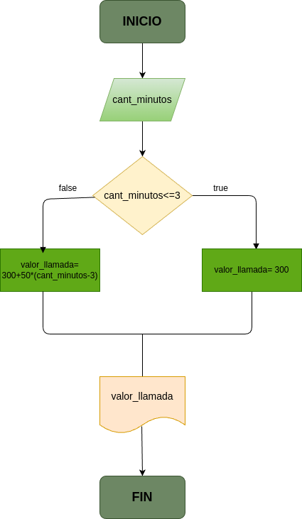

### Costo de una llamada telefònica

Ingresar el tiempo de duraciòn de una llamada telefònica y determinar la cantidad a pagar de acuerdo a lo siguiente:
- Toda llamada que dure 3 minutos o menos tiene un costo de 300 pesos.
- Cada minuto adicional cuesta 50 pesos.

 
